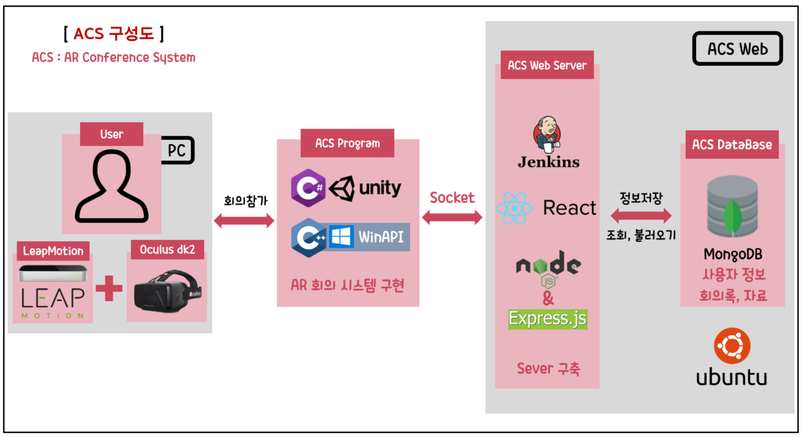

# AR 기반 실시간 화면 공유 회의 시스템 (ACS hanium_2019)

AR 기반 실시간 화면 공유 회의 시스템(*ACS*)입니다.  
AR과 VR을 이용해 3차원 공간에 정보들을 시각적으로 배치하여 이를 실시간으로 공유해 서로 간의 의사소통을 원활하게 하여 회의 내용을 전달하기 위해 소모되는 불필요한 시간을 절약 해줍니다.

AR-based real-time screen sharing conference system.
By using AR and VR to visually arrange information in 3-dimensional space and sharing it in real time, it facilitates communication between each other and saves unnecessary time for delivering the contents of the meeting.

## 👨‍💻프로젝트 주요 내용

 ● Win API를 활용한 회의 자료를 3D 공간화 하여 AR로 출력
 
 ● 립모션을 이용한 Window 프로세스 제어
 
 ● 한 화면에서 내가 보는 시각적인 정보를 공유하여 생동감 있는 회의 진행
 
 ● AR 회의 중 립모션 인식으로 웹 플렛폼 공유폴더에 손쉽게 문서, 사진 자료 전송 가능
 
 ● 로그인 시스템으로 회의 참가자의 정보를 공유폴더에 저장하고 조회
 
 ● 회의 후 참여자의 정보, 사용된 문서가 자동으로 정리되어 이후에 새로운 회의 참가자도 조회 가능 

## 📑구성도

## 🤝역할 분담

|  
분  류
 |  
담  당
 |  
개발 내용
 |  
진행 사항
 |
|:--------|:--------:|--------:|--------:| 
|
Web 
 | 
박영준 이호찬 
 |*Node.js, database, Javascript, socket.io*|
[Web](https://github.com/hanium2019/hanium_2019/blob/master/web/webreadme.md) 
 |
|
Unity 
 |
김수빈 김민수
 |*LeapMotion, Oculus*|
[Oculus Unity](https://github.com/hanium2019/hanium_2019/blob/master/Oculus_Unity/Oculus_Unity.md), [Leap Motion](https://github.com/hanium2019/hanium_2019/blob/master/leapMotion/leapMotion.md)
 |
<<<<<<< HEAD
<<<<<<< HEAD
|
WinAPI 
|
김세진 송진호
 |*WinAPI 프로세스 사용 코드 분석*|
[WinAPI](https://github.com/hanium2019/hanium_2019/blob/master/winAPI/WinAPI.md)
 |
=======
|
WinAPI 
|
김세진 송진호
 |*WinAPI 프로세스 사용 코드 분석*|
[WinAPI](https://github.com/hanium2019/hanium_2019/blob/master/WinAPI/WinApi.md)
 |
>>>>>>> 49a6ee8b3f4a18a0399c8b31397932f23764877f
=======
|
WinAPI 
|
김세진 송진호
 |*WinAPI 프로세스 사용 코드 분석*|
[WinAPI](https://github.com/hanium2019/hanium_2019/blob/master/WinAPI/WinApi.md)
 |
>>>>>>> 49a6ee8b3f4a18a0399c8b31397932f23764877f
